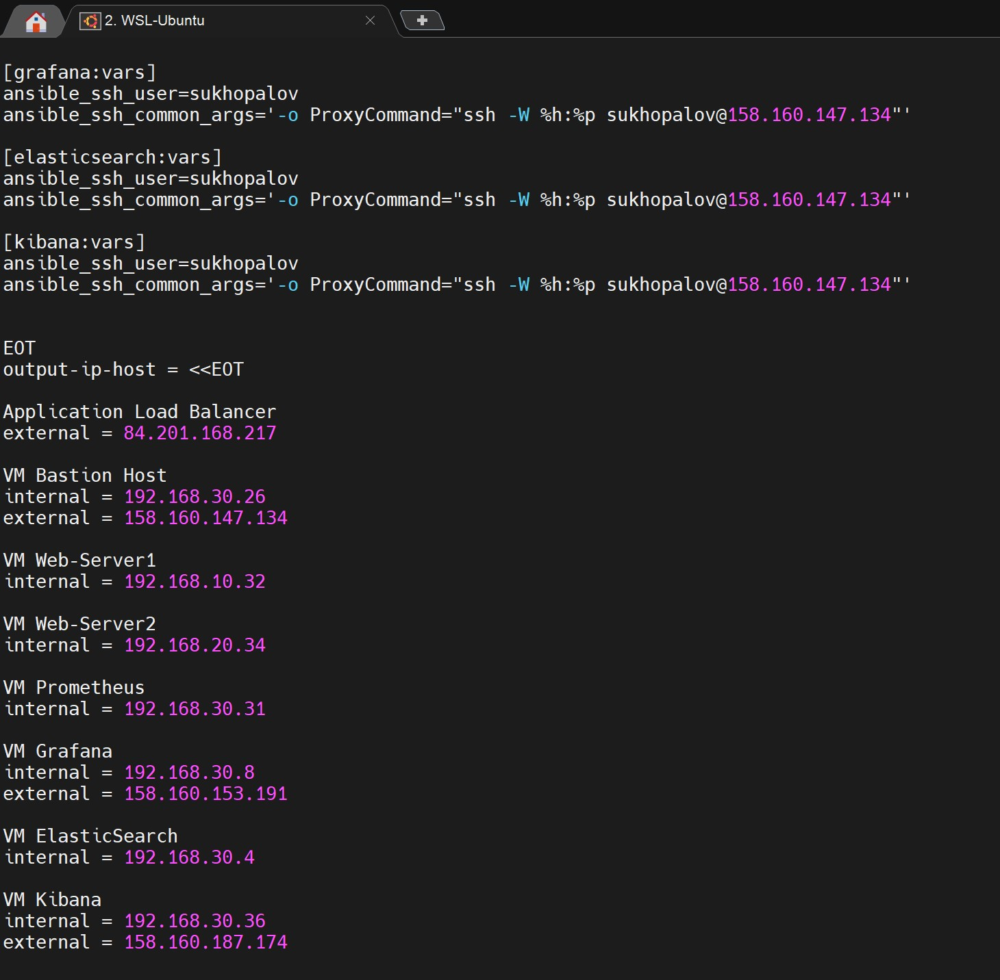
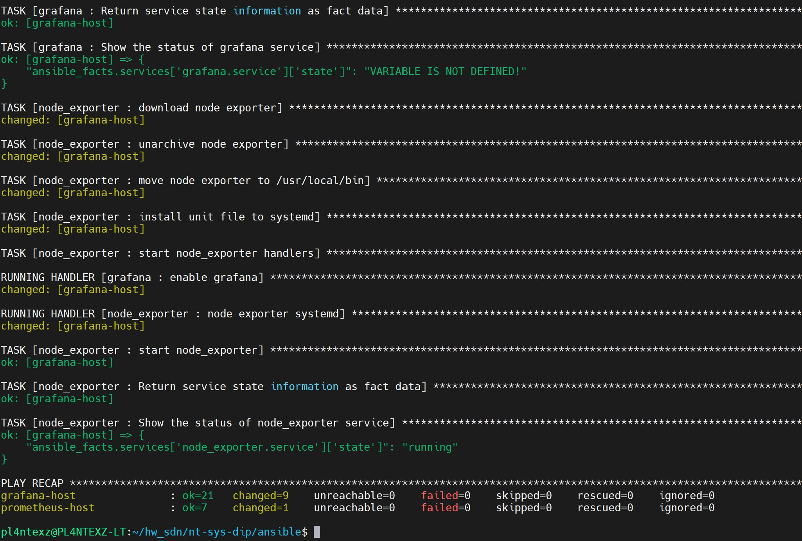

#  Дипломная работа по профессии «Системный администратор»

Содержание
==========
* [Задача](#задача)
* [Инфраструктура](#инфраструктура)
    * [Сайт](#сайт)
    * [Логи](#логи)
    * [Мониторинг](#мониторинг)
    * [Сеть](#сеть)
    * [Резервное копирование](#резервное-копирование)

---------
## Задача
Ключевая задача — разработать отказоустойчивую инфраструктуру для сайта, включающую мониторинг, сбор логов и резервное копирование основных данных. Инфраструктура должна размещаться в [Yandex Cloud](https://cloud.yandex.com/).

## Инфраструктура
Для развёртки инфраструктуры используем [Terraform](./terraform), а для установки ПО [Ansible](./ansible).

Terraform:

Проверяем правильность синтаксиса файлов Terraform "terraform validate"

 

Просматриваем план создание инфраструктуры "terraform plan"

И запускаем "terraform apply"

Дожидаемся окончания создания инфраструктуры и вывода информации output

Заранее подготовленный [output-ansible-hosts](./terraform/output.tf) сохраняем в отдельный файл hosts для ansible и удаляем лишнее из файла

Проверяем доступность созданных ВМ с помощью ansible all -m ping

Переходим к установке и настройке ПО с помощью Ansible

### Сайт
Запускаем playbook - [webservers-playbook.yml](./ansible/webservers-playbook.yml)

По окончанию выполнения playbook проверяем что сервисы nginx, node_exporter и nginx_logexporter работаю

Проверяем что наш сайт работает

### Логи
Запускаем playbook - [log-playbook.yml](./ansible/log-playbook.yml)

По завершению выполнения playbook проверяем что контейнеры с elasticsearch и kibana работают

Уставноку filebeat - [log-filebeat-playbook.yml](./ansible/log-filebeat-playbook.yml)

Заходим в Kibana для проверки что логи nginx с web серверов поступают

### Мониторинг
Запускаем playbook - [monitoring-playbook.yml](./ansible/monitoring-playbook.yml)

Проверяем что работа playbook завершилась без ошибок

Заходим в Grafana для проверки работоспособности наших ранее импортированных дашбордов 

NGINX Servers Metrics:

Node Exporter Full:

### Сеть

### Резервное копирование

